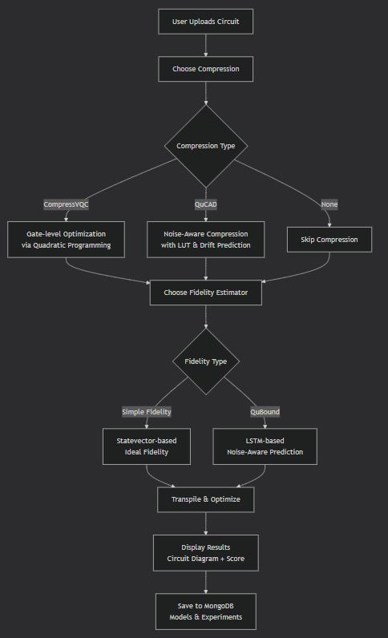
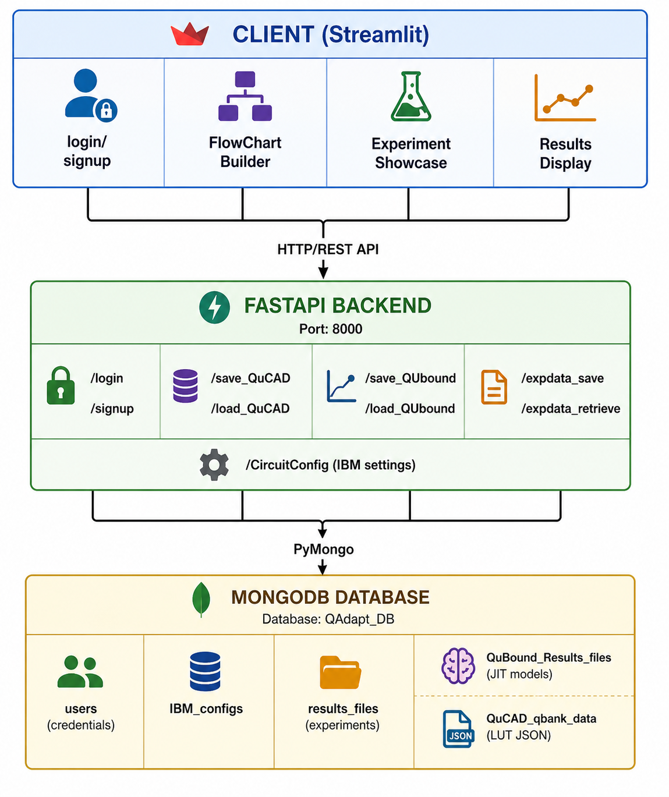
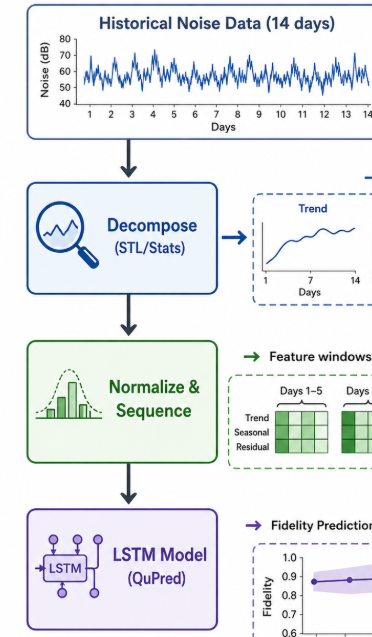

# Quantum Compression and Performance Prediction Platform

> An integrated environment for quantum circuit optimization, noise-aware compression, and performance prediction on near-term quantum devices.

## Project Overview

This website provides an environment for Quantum Circuit Creation, experimentation, compression and performance prediction for quantum devices. It essentially brings the Quantum Algorithms that were implemented in the lab to be showcased by you.

This platform bridges the gap between theoretical quantum algorithms and real hardware limitations by offering:

- **Visual Workflow builder** for quantum circuit experimentation
- **Advanced compression techniques** (CompressVQC and QuCAD) that reduce circuit depth while preserving functionality
- **Noise-aware fidelity prediction** (QuBound) using LSTM-based models trained on historical device noise
- **Database-backed experiment persistence** with MongoDB

Following is the screenshot of the high level user workflow:

## System Architecture

The application follows a **client-server architecture**:

## Key Modules

### 1. FlowChart Builder

This is the visual UI where the users use the drag-and-drop Quantum Nodes:

| Node Type | Function |
|-----------|----------|
| **Circuit Node** | Upload .qpy circuit file |
| **Backend Node** | Select target quantum hardware (default: ibm_fez) |
| **CompressVQC** | Gate-level parameter compression |
| **QuCAD** | Noise-aware circuit compression |
| **QuBound** | ML-based fidelity prediction |
| **Simple Fidelity** | Ideal statevector fidelity |
| **Transpile Node** | Qiskit circuit optimization |

### 2. Compression Algorithms

#### CompressVQC (`CompVQC.py`)
- Creates Look-Up Table (LUT) mapping gate angles → transpiled depth
- Formulates compression as Quadratic Program
- Solves using QAOA/ADMM optimization

#### QuCAD (`QuCAD.py`)
- Extracts noise features (T₁, T₂, gate errors) per qubit
- Clusters qubits by reliability using K-Means
- Trains noise-aware models for each cluster
- Predicts noise drift to select optimal qubit mapping

### 3. Fidelity Prediction - QuBound (`test_QBound.py`)

The QuBound module provides noise-aware fidelity prediction using LSTM-based models:

### 4. Database Layer (`dbConnection.py`, `backend.py`)

**Collections:**
- `users`: Authentication credentials
- `IBM_configs`: Circuit execution configurations
- `results_files`: Stored experiment results (Base64 encoded circuits)
- `QuBound_Results_files`: PyTorch JIT models for fidelity prediction
- `QuCAD_qbank_data`: JSON Look-Up Tables for QuCAD compression